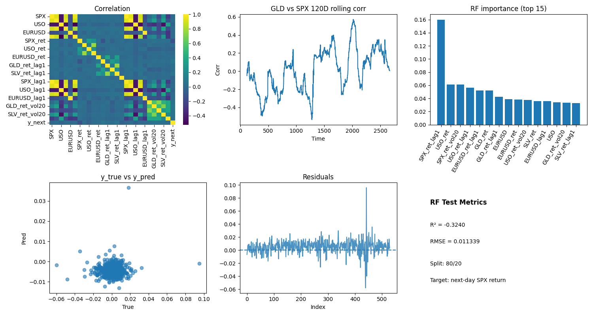

# Macro Signals & SPX — Next-Day Return Test

[](https://github.com/XueXinping18/ids_706/actions/workflows/ci.yaml)

## Problem

On top of the previous mini-assigments, my additional problem that I try to figure out can be described in one sentence. Can yesterday’s information from **GLD (gold)**, **USO (oil)**, **SLV (silver)** and **EURUSD** help predict the **next-day return of SPX**?
I evaluate this on daily data (2015–2025) with a chronological train/test split and compare against a naïve baseline.

## Dataset

* Source: Kaggle — *Gold Price 2015–2025*
* File: `gold_data_2015_25.csv` (downloaded automatically on first run)
* Columns used: `Date`, `SPX`, `GLD`, `USO`, `SLV`, `EUR/USD`

## Setup

### Local

```bash
make install
make analyze
```

### Docker

```bash
make docker-build
make docker-run
```

## The functionality of the code

1. **Load & Inspect** – prints `.info()` / `.describe()`, checks missing values & duplicates.
2. **Enrich** – adds `year` where a date column exists; reports yearly stats.
3. **Baseline ML (levels)** – quick Linear Regression & Random Forest using numeric columns; 80/20 split.
4. **Next-Day Experiment (returns)** – builds returns, lags (t-1), 20-day vol, and predicts `SPX` **next-day return**.
5. **Figures** – two outputs:

   * `gold_analysis.png` – EDA dashboard
     
   * `nextday_summary.png` – one-page panel for the next-day test (heatmap, GLD–SPX rolling corr, RF importance, y_true vs y_pred, residuals, and metrics)
     

## Data preparation (for the next-day test)

* Normalize column names (`EUR/USD → EURUSD`).
* Compute daily returns for SPX/GLD/USO/SLV/EURUSD.
* Add 1-day lags for returns and levels; add 20-day rolling vol on returns.
* Target: `y_next = SPX_ret.shift(-1)`.
* Drop rows introduced by `pct_change/rolling/shift`.
* Mean imputation for any remaining numeric NAs when training baselines.

## Methods

* **Split:** 80% train / 20% test in time order.
* **Baseline:** yesterday’s SPX return.
* **Models:** Linear Regression, Random Forest (seed=42).
* **Metrics:** R² and RMSE on the test set.

## Results & Insights

1) Setup. I test a one-day horizon: yesterday’s GLD/USO/SLV/EURUSD with simple transforms (returns, lag-1, 20-day volatility) to predict next-day SPX return. Train/test is chronological (80/20).

2) Baseline. I use a naïve rule (yesterday’s SPX return) as the minimal benchmark for any short-horizon signal.

3) Out-of-sample result. In this run the Random Forest gives R² ≈ −0.324 with RMSE ≈ 0.0113 on the test set. A negative R² means it underperforms a constant-mean prediction; mapping yesterday’s public data to tomorrow’s return is not learnable here.

4) Feature importance vs usefulness. SPX_ret_lag1 ranks highest, but the y_true vs y_pred panel clusters near zero and residuals look noise-like. An important feature inside a model does not guarantee better out-of-sample accuracy.

5) Regimes don’t translate to an edge. The GLD–SPX 120-day rolling correlation moves across periods (risk-on/off), yet the day-ahead forecast does not improve during those swings. Time-varying correlation does not imply exploitable next-day predictability.

6) EMH implication. The findings align with weak-form EMH: using only historical prices and returns from liquid assets, next-day returns are hard to predict beyond trivial baselines.

7) Practical takeaway. For day-ahead timing, I treat cross-asset signals as context rather than a forecast engine. If I extend this work, I will consider longer horizons (weekly/monthly), volatility or tail-risk targets, and event/regime filters with strict out-of-sample tests.


## Testing

```bash
make test
```

The suite covers loading (local vs. Kaggle fallback), inspection, enrichment/year extraction, ML edge cases, plotting (mocked), and a small end-to-end pipeline.

## Tooling

* **CI:** GitHub Actions runs format (black), lint (flake8), tests, and analysis; badge above.
* **Makefile:** `install`, `format`, `lint`, `test`, `analyze`, `clean`.

## Repo structure

```
.
├── gold_analysis.py
├── test_gold_analysis.py
├── Makefile
├── requirements.txt
├── Dockerfile
└── .github/workflows/ci.yaml
```


